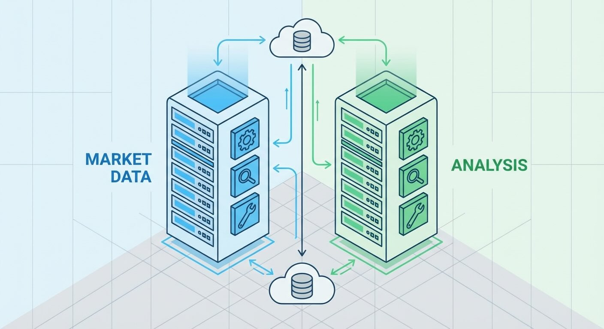

# Building an MCP Agentic Stock Trading System - Part 2: The MCP Servers and Tools

*This is Part 2 of a series on building an MCP trading system. [Read Part 1](https://www.mosaicmeshai.com/blog/building-an-mcp-agentic-stock-trading-system-part-1) for the overall architecture and three-agent setup.*

## The Hook

MCP servers are like USB hubs for AI—they provide standardized tools that any agent can plug into. My trading system has two: one fetches market data, the other calculates technical indicators. Write them once, use them with Claude, local LLMs, or even traditional code.

## The Story

I built two MCP servers as separate Node.js processes:

```
┌──────────────────────────────────────────────────────────────┐
│                    Market Data Server                        │
├──────────────────────────────────────────────────────────────┤
│ • get_current_price      Real-time stock prices              │
│ • get_historical_prices  Daily data (100 days or 20+ years)  │
│ • get_intraday_prices    Minute-level data                   │
│ • get_quote              Detailed quote info                 │
│ • search_symbols         Find stocks by company name         │
└──────────────────────────────────────────────────────────────┘

┌──────────────────────────────────────────────────────────────┐
│                     Analysis Server                          │
├──────────────────────────────────────────────────────────────┤
│ • calculate_sma          Simple Moving Average               │
│ • calculate_ema          Exponential Moving Average          │
│ • calculate_rsi          Relative Strength Index             │
│ • calculate_macd         Trend momentum indicator            │
│ • calculate_bollinger    Volatility bands                    │
│ • detect_trend           Uptrend/downtrend/sideways          │
│ • generate_signals       Buy/sell/hold recommendations       │
└──────────────────────────────────────────────────────────────┘
```

*Two MCP servers providing 11 tools to all trading agents*



The [Market Data Server](https://github.com/bart-mosaicmeshai/agentic-stock-trader/blob/main/src/mcp-servers/market-data-server.js) ([tool definitions](https://github.com/bart-mosaicmeshai/agentic-stock-trader/blob/main/src/mcp-servers/market-data-server.js#L39-L124)) and [Analysis Server](https://github.com/bart-mosaicmeshai/agentic-stock-trader/blob/main/src/mcp-servers/analysis-server.js) ([tool definitions](https://github.com/bart-mosaicmeshai/agentic-stock-trader/blob/main/src/mcp-servers/analysis-server.js#L33-L195)) each define their tools using JSON schemas, then handle requests via stdio. The agents spawn these as child processes and communicate through standard input/output. No HTTP, no sockets—just pipes.

Here's what a tool definition looks like ([analysis-server.js:75-93](https://github.com/bart-mosaicmeshai/agentic-stock-trader/blob/main/src/mcp-servers/analysis-server.js#L75-L93)):

```javascript
{
  name: 'calculate_rsi',
  description: 'Calculate Relative Strength Index',
  inputSchema: {
    type: 'object',
    properties: {
      prices: {
        type: 'array',
        description: 'Array of closing prices',
        items: { type: 'number' }
      },
      period: {
        type: 'number',
        description: 'Period for RSI (typically 14)',
        default: 14
      }
    },
    required: ['prices']
  }
}
```

When an agent (rule-based, Claude, or local LLM) needs RSI, it calls this tool with an array of prices. The MCP server calculates and returns the result ([implementation here](https://github.com/bart-mosaicmeshai/agentic-stock-trader/blob/main/src/mcp-servers/analysis-server.js#L223-L246)). Same tool, three different consumers.

## The Reflection

This separation is powerful. I can add new tools to the MCP servers, and all three agents instantly get access. No copying code, no duplicating logic. The servers are dumb—they just do math and fetch data. The intelligence lives in how the agents use these tools.

Next up: showing how the agents actually call these tools and make decisions.

---

## Project

**agentic-stock-trader** - [View on GitHub](https://github.com/bart-mosaicmeshai/agentic-stock-trader)

*[Update the GitHub link above if the project name differs from the repo name, or remove if not applicable]*

---

## Meta

- **Category**: Learning (Exploring and experimenting)
- **Project**: agentic-stock-trader
- **Word count target**: 150-300 words
- **Writing time**: ~15-20 minutes
- **Inspiration**: Simon Willison's daily blog, Seth Godin's short posts

## Publishing Checklist

- [ ] Hook is compelling and specific
- [ ] Story shows real work, not just summary
- [ ] Reflection adds insight or learning
- [ ] Post is 150-300 words
- [ ] Code examples (if any) are formatted and explained
- [ ] Links to relevant resources
- [ ] Proofread for typos
- [ ] Update published: true in frontmatter

---

*This post is part of my daily AI journey blog at [Mosaic Mesh AI](https://www.mosaicmeshai.com/blog). Building in public, learning in public, sharing the messy middle of AI development.*
