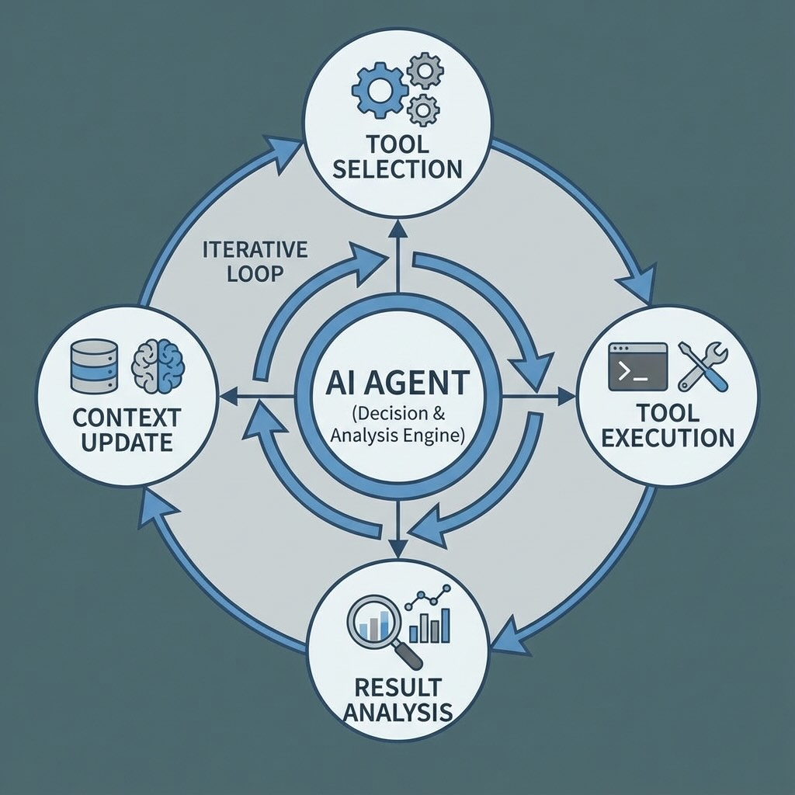

# Building an MCP Agentic Stock Trading System - Part 3: The Agentic Loop

*This is Part 3 of a series on building an MCP trading system. Read [Part 1](https://www.mosaicmeshai.com/blog/building-an-mcp-agentic-stock-trading-system-part-1-the-architecture) for the architecture overview and [Part 2](https://www.mosaicmeshai.com/blog/building-an-mcp-agentic-stock-trading-system-part-2-the-mcp-servers-and-tools) for the MCP servers and tools.*

## The Hook

The agentic loop is where LLMs become active problem-solvers instead of passive responders. The LLM doesn't just answer once—it iteratively calls tools, analyzes results, and decides what to check next. My trading agent uses this to analyze stocks: fetch data, calculate indicators, check trends, then make a decision.

## The Story

Here's how the agentic loop works in my system ([llm-trading-agent.js:280-353](https://github.com/bart-mosaicmeshai/agentic-stock-trader/blob/main/src/agents/llm-trading-agent.js#L280-L353)):

1. **Send initial request**: "Analyze AAPL for trading opportunities"
2. **LLM responds**: `stop_reason: 'tool_use'` - "I need historical data"
3. **Execute tool locally**: Call `get_historical_prices('AAPL')` via MCP
4. **Send results back**: Add tool response to conversation
5. **LLM responds again**: `stop_reason: 'tool_use'` - "Let me check RSI"
6. **Execute tool**: Call `calculate_rsi(prices)` via MCP
7. **Send results back**: Add RSI result to conversation
8. **LLM continues**: Maybe checks trend, MACD, moving averages...
9. **LLM finishes**: `stop_reason: 'end_turn'` - "BUY 10 shares, confidence 0.75, reasoning..."



The loop runs until the LLM has enough information to decide. It's not scripted—the model chooses which tools to use and in what order.

```javascript
while (continueLoop) {
  const response = await anthropic.messages.create({
    model: 'claude-3-haiku',
    tools: this.getMCPTools(),
    messages: messages,
  });

  if (response.stop_reason === 'tool_use') {
    // Execute tools, add results to messages
    // Loop continues
  } else if (response.stop_reason === 'end_turn') {
    // LLM is done, parse decision
    continueLoop = false;
  }
}
```

## The Reflection

This is fundamentally different from rules-based systems. The rules-based agent always checks the same indicators in the same order. LLMs adapt—if RSI looks neutral, maybe check something else. If volume is unusual, investigate further.

Both Claude (via API) and the local LLM (via LM Studio) use this same loop pattern. Same architecture, different models, different intelligence.

Next: comparing what the three agents actually decide when analyzing the same stock.

---

## Project

**agentic-stock-trader** - [View on GitHub](https://github.com/bart-mosaicmeshai/agentic-stock-trader)

*[Update the GitHub link above if the project name differs from the repo name, or remove if not applicable]*

---

## Meta

- **Category**: Learning (Exploring and experimenting)
- **Project**: agentic-stock-trader
- **Word count target**: 150-300 words
- **Writing time**: ~15-20 minutes
- **Inspiration**: Simon Willison's daily blog, Seth Godin's short posts

## Publishing Checklist

- [ ] Hook is compelling and specific
- [ ] Story shows real work, not just summary
- [ ] Reflection adds insight or learning
- [ ] Post is 150-300 words
- [ ] Code examples (if any) are formatted and explained
- [ ] Links to relevant resources
- [ ] Proofread for typos
- [ ] Update published: true in frontmatter

---

*This post is part of my daily AI journey blog at [Mosaic Mesh AI](https://www.mosaicmeshai.com/blog). Building in public, learning in public, sharing the messy middle of AI development.*
