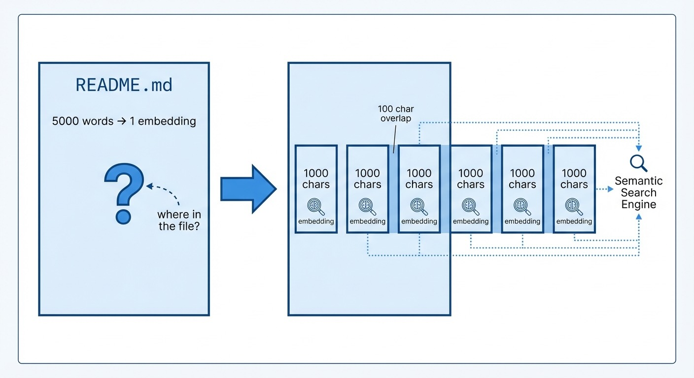

# Building a Local Semantic Search Engine - Part 3: Indexing and Chunking

*This is Part 3 of a series on building a local semantic search engine. Read [Part 1](https://www.mosaicmeshai.com/blog/building-a-local-semantic-search-engine-part-1-what-are-embeddings) for embeddings basics and [Part 2](https://www.mosaicmeshai.com/blog/building-a-local-semantic-search-engine-part-2-from-keywords-to-meaning) for how semantic search works.*

## The Hook

I pointed the search engine at itself—indexing the embeddinggemma project's own 3 files into 20 chunks. Why 20 chunks from 3 files? Because a 5,000-word README as a single embedding buries the relevant section. Chunking solves that.

## The Story

The search engine's indexer walks a directory, reads text files, and generates embeddings for each. Without chunking, searching a large file tells you *which* file matches—but not *where* in that file. Paragraph 12 of 50? Good luck.



*Chunking with overlap ensures context isn't lost at boundaries*

The solution: split files into [overlapping chunks](https://www.pinecone.io/learn/chunking-strategies/). This is a common pattern in [RAG](https://www.pinecone.io/learn/retrieval-augmented-generation/) (Retrieval-Augmented Generation) systems—you retrieve relevant chunks to give an LLM context before it answers.

I use 1,000 characters per chunk with 100 characters of overlap ([semantic_search.py:51-84](https://github.com/bart-mosaicmeshai/embeddinggemma/blob/main/semantic_search.py#L51-L84)):

```python
def chunk_text(text, max_chars=1000, overlap=100):
    if len(text) <= max_chars:
        return [text]

    chunks = []
    start = 0
    while start < len(text):
        end = start + max_chars
        chunk = text[start:end]

        # Try to break at sentence or newline
        if end < len(text):
            last_period = chunk.rfind('.')
            last_newline = chunk.rfind('\n')
            break_point = max(last_period, last_newline)
            if break_point > max_chars // 2:
                chunk = chunk[:break_point + 1]

        chunks.append(chunk.strip())
        start = end - overlap
    return chunks
```

Two details preserve context: the 100-character overlap ensures key phrases aren't split across chunk boundaries, and breaking at sentence endings (when possible) avoids embeddings for incomplete thoughts.

**Note:** The indexer skips common directories like `venv`, `node_modules`, and `.git` automatically ([semantic_search.py:25-29](https://github.com/bart-mosaicmeshai/embeddinggemma/blob/main/semantic_search.py#L25-L29)). No one wants to search their virtual environment.

## The Reflection

Chunk size is a tradeoff I didn't spend much time optimizing. Smaller chunks give precise matches but lose surrounding context. Larger chunks preserve context but dilute the embedding signal. I picked 1,000 characters as a reasonable default—roughly a function or a few paragraphs—and moved on. A production system would need careful tuning here.

The bigger lesson: chunking strategy matters more than I expected. It's not just about breaking up text—it's about what constitutes a "unit of meaning" worth embedding.

Next: making this fast with embedding caches. (Spoiler: the difference between "wait for it..." and instant is a single JSON file.)

---

**Part 3 of 5** in the EmbeddingGemma series.

---

## Project

**embeddinggemma** - [View on GitHub](https://github.com/bart-mosaicmeshai/embeddinggemma)

---

## Meta

- **Category**: Building (Creating something new)
- **Project**: embeddinggemma
- **Word count target**: 150-300 words
- **Writing time**: ~15-20 minutes
- **Inspiration**: Simon Willison's daily blog, Seth Godin's short posts

## Publishing Checklist

- [ ] Hook is compelling and specific
- [ ] Story shows real work, not just summary
- [ ] Reflection adds insight or learning
- [ ] Post is 150-300 words
- [ ] Code examples (if any) are formatted and explained
- [ ] GitHub links to specific code lines
- [ ] Image generated and added
- [ ] ASCII diagrams removed (kept only as image reference)
- [ ] Links to relevant resources
- [ ] Proofread for typos
- [ ] Update published: true in frontmatter

---

*This post is part of my daily AI journey blog at [Mosaic Mesh AI](https://www.mosaicmeshai.com/blog). Building in public, learning in public, sharing the messy middle of AI development.*
