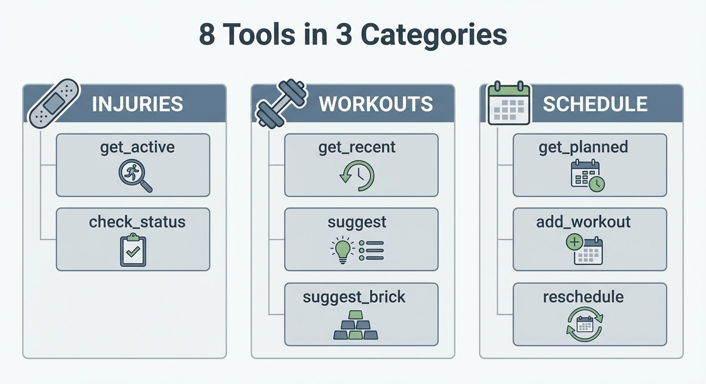

# Building an Agentic Personal Trainer - Part 2: The Tool System

*This is Part 2 of a series on building an agentic personal trainer. [Read Part 1](https://www.mosaicmeshai.com/blog/building-an-agentic-personal-trainer-part-1-architecture-and-philosophy) for the architecture overview and coaching philosophy.*

## The Hook

An LLM without tools is just a chatbot. To make a real coaching agent, I needed to give it hands—ways to check injuries, recall workouts, and manage schedules.

## The Story

[LangChain tools](https://js.langchain.com/docs/modules/agents/tools/) follow a simple pattern: name, description, and a function. The description is critical—it's how the LLM decides when to use each tool.

Here's the injury checking tool ([injury-tool.js:7-27](https://github.com/bart-mosaicmeshai/agentic-personal-trainer/blob/main/src/tools/injury-tool.js#L7-L27)):

```javascript
export const getInjuriesTool = new Tool({
  name: "get_active_injuries",
  description: "Get list of current active injuries. Use this
    to check what injuries the athlete has before recommending workouts.",
  func: async (input) => {
    const injuries = getActiveInjuries();
    if (injuries.length === 0) return "No active injuries.";
    return injuries.map(i =>
      `- ${i.name} (${i.severity}): Affects ${i.affects.join(', ')}`
    ).join('\n');
  }
});
```



*Eight tools across three categories: injuries, workouts, and scheduling*

The prototype contains 8 tools across three categories:

**Injuries** ([injury-tool.js](https://github.com/bart-mosaicmeshai/agentic-personal-trainer/blob/main/src/tools/injury-tool.js)): `get_active_injuries`, `check_injury_status`

**Workouts** ([workout-tool.js](https://github.com/bart-mosaicmeshai/agentic-personal-trainer/blob/main/src/tools/workout-tool.js)): `get_recent_workouts`, `suggest_workout`, `suggest_brick_workout`

**Schedule** ([schedule-tool.js](https://github.com/bart-mosaicmeshai/agentic-personal-trainer/blob/main/src/tools/schedule-tool.js)): `get_planned_schedule`, `add_planned_workout`, `reschedule_workout`

The `suggest_workout` tool ([workout-tool.js:33-82](https://github.com/bart-mosaicmeshai/agentic-personal-trainer/blob/main/src/tools/workout-tool.js#L33-L82)) takes JSON with a `feeling` field—energy level, not performance metrics. When the athlete says "I'm wiped," the agent can pass `{feeling: "tired"}` and get recovery-focused suggestions like yoga or an easy swim.

```javascript
if (feeling === 'tired' || feeling === 'low_energy') {
  suggestions.push('Yoga (recovery focus)');
  suggestions.push('Easy swim (30-40 min, low intensity)');
  suggestions.push('Light walk or stretching');
}
```

The `check_injury_status` tool ([injury-tool.js:29-40](https://github.com/bart-mosaicmeshai/agentic-personal-trainer/blob/main/src/tools/injury-tool.js#L29-L40)) doesn't actually check anything—it returns a prompt telling the agent to ask the user. Some tools are action triggers, others are conversation prompts. This distinction matters: the tool signals the agent to gather information rather than execute an action.

## The Reflection

The description matters more than the implementation. A perfectly coded tool with a vague description will never get called. Write descriptions like you're explaining to a new hire when to use each capability.

Tool descriptions deserve more attention than they typically get. The LLM reads those descriptions to decide which tool fits the user's request. Vague descriptions = wrong tool choices = bad coaching.

Next: the system prompt that shapes the agent's personality.

---

**Part 2 of 9** in the Agentic Personal Trainer series.

---

## Project

**agentic-personal-trainer** - [View on GitHub](https://github.com/bart-mosaicmeshai/agentic-personal-trainer)

---

## Meta

- **Category**: Building (Creating something new)
- **Project**: agentic-personal-trainer
- **Word count target**: 150-300 words
- **Writing time**: ~15-20 minutes
- **Inspiration**: Simon Willison's daily blog, Seth Godin's short posts

## Publishing Checklist

- [ ] Hook is compelling and specific
- [ ] Story shows real work, not just summary
- [ ] Reflection adds insight or learning
- [ ] Post is 150-300 words
- [ ] Code examples (if any) are formatted and explained
- [ ] GitHub links to specific code lines
- [ ] Image generated and added
- [ ] ASCII diagrams removed (kept only as image reference)
- [ ] Links to relevant resources
- [ ] Proofread for typos
- [ ] Update published: true in frontmatter

---

*This post is part of my daily AI journey blog at [Mosaic Mesh AI](https://www.mosaicmeshai.com/blog). Building in public, learning in public, sharing the messy middle of AI development.*
