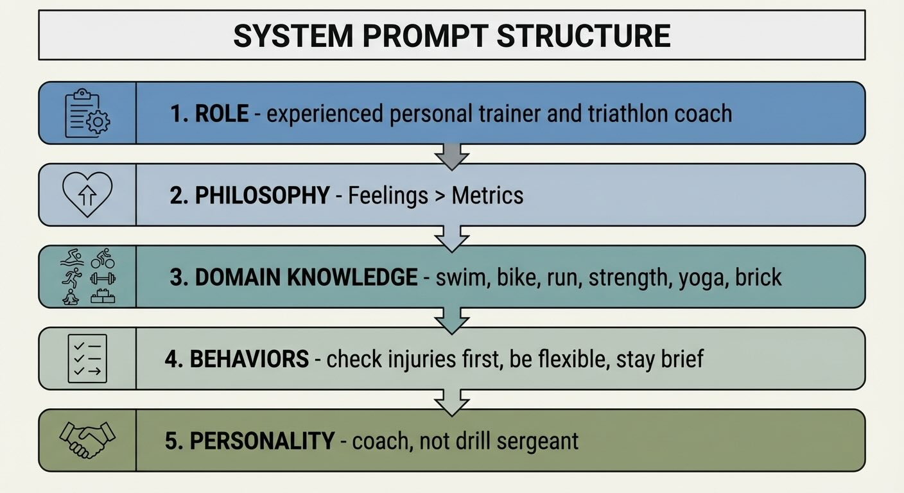

# Building an Agentic Personal Trainer - Part 3: The System Prompt

*This is Part 3 of a series on building an agentic personal trainer. Read [Part 1](https://www.mosaicmeshai.com/blog/building-an-agentic-personal-trainer-part-1-architecture-and-philosophy) for the architecture overview and [Part 2](https://www.mosaicmeshai.com/blog/building-an-agentic-personal-trainer-part-2-the-tool-system) for the tool system.*

## The Hook

Tools give the agent capabilities but the system prompt gives the agent its personality. Getting the tone right—in this case "coach, not drill sergeant"—requires iteration, opinion, and intuition, not just correct syntax.

## The Story

Here's the full system prompt ([trainer-agent.js:84-112](https://github.com/bart-mosaicmeshai/agentic-personal-trainer/blob/main/src/agent/trainer-agent.js#L84-L112)):

```javascript
prefix: `You are an experienced personal trainer and triathlon coach
having a friendly, conversational chat with an athlete.

Your coaching philosophy:
- You focus on how the athlete is FEELING, not just data
- You adapt to their real-life schedule and constraints
- You remember past conversations, injuries, and preferences
- You suggest workouts, you don't prescribe rigid plans
- You're aware of injuries and always prioritize safety
- You're encouraging and supportive

The athlete trains in:
- Swim (pool and open water)
- Bike (outdoor and Wahoo SYSTM indoor)
- Run (road, trail, track)
- Strength training
- Yoga (recovery and flexibility)
- Brick workouts (multi-discipline sessions)

You can also suggest variety like hiking, rowing, paddleboarding,
pilates, or other activities.

Key behaviors:
1. Before recommending workouts, check for active injuries
2. Ask how injuries are feeling if relevant
3. Consider recent workout history for variety
4. Be flexible - easily reschedule when life happens
5. Remember past preferences and conversations
6. Keep responses conversational and brief

Always be warm, encouraging, and adaptable.
You're a coach, not a drill sergeant.`
```



*Five layers: role, philosophy, domain knowledge, behaviors, and personality*

Let me break down why each section matters:

**Role definition**: "experienced personal trainer and triathlon coach having a friendly, conversational chat" - This isn't just "you are a trainer." It's setting the tone: experienced (authoritative), friendly (approachable), conversational (not clinical).

**Philosophy section**: The all-caps "FEELING" is intentional—a signal to emphasize this priority, though how much LLMs actually weight formatting remains an open question and would be a good area for further testing and experimentation with this prototype. "Suggest workouts, you don't prescribe" draws a clear line between collaborative and authoritarian.

**Domain knowledge**: Listing specific activities (Wahoo SYSTM, brick workouts) gives the agent vocabulary. Without this, it might suggest "cycling" when I want it to distinguish between outdoor rides and indoor trainer sessions.

**Key behaviors**: These are explicit instructions, numbered for clarity. "Before recommending workouts, check for active injuries" directly shapes tool selection. The agent knows to call `get_active_injuries` before `suggest_workout`.

**The anchor line**: "You're a coach, not a drill sergeant." This single sentence does more work than any other. It's memorable, it's contrastive, and it gives the LLM a clear mental model.

### What Didn't Work

Two issues emerged early:

**Too focused on injuries**: With my injury history in the database, the agent mentioned injuries in nearly every response. "Given your knee issues, maybe consider..." became a broken record. The fix was dialing back the injury emphasis—awareness without anxiety.

**Too much drill sergeant**: The agent initially wanted to focus on training for specific events, pushing structured plans. That's not what I wanted. The shift to "how are you feeling?" and "coach, not drill sergeant" came from realizing I needed a collaborative partner, not a task master.

The current prompt is 30 lines. Every line earns its place. Longer prompts aren't necessarily better—they can dilute the key instructions and confuse the LLM about priorities. Concise and opinionated beats comprehensive and vague.

## The Reflection

[Prompt engineering](https://www.promptingguide.ai/) is character development. Building this prototype reinforced for me that system prompts aren't instructions—they're defining a personality that will respond to situations that I as the developer can't predict.

The breakthrough was realizing the prompt needs to be opinionated. "Coach, not drill sergeant" is a choice. A different product might want drill sergeant energy. But making that choice explicit gives the LLM something to anchor on.

The prompt will keep evolving. Every conversation that feels "off" provides feedback for the next iteration.

Next up: connecting to Garmin for real workout data.

---

**Part 3 of 9** in the Agentic Personal Trainer series.

---

## Project

**agentic-personal-trainer** - [View on GitHub](https://github.com/bart-mosaicmeshai/agentic-personal-trainer)

---

## Meta

- **Category**: Learning (Exploring and experimenting)
- **Project**: agentic-personal-trainer
- **Word count target**: 150-300 words
- **Writing time**: ~15-20 minutes
- **Inspiration**: Simon Willison's daily blog, Seth Godin's short posts

## Publishing Checklist

- [ ] Hook is compelling and specific
- [ ] Story shows real work, not just summary
- [ ] Reflection adds insight or learning
- [ ] Post is 150-300 words
- [ ] Code examples (if any) are formatted and explained
- [ ] GitHub links to specific code lines
- [ ] Image generated and added
- [ ] ASCII diagrams removed (kept only as image reference)
- [ ] Links to relevant resources
- [ ] Proofread for typos
- [ ] Update published: true in frontmatter

---

*This post is part of my daily AI journey blog at [Mosaic Mesh AI](https://www.mosaicmeshai.com/blog). Building in public, learning in public, sharing the messy middle of AI development.*
