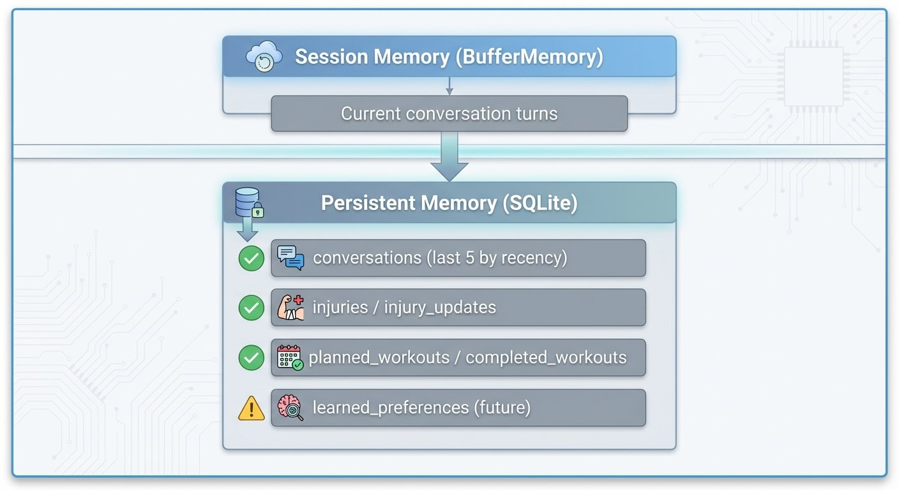

# Building an Agentic Personal Trainer - Part 6: Memory and Learning

*This is Part 6 of a series on building an agentic personal trainer. Read [Part 1](https://www.mosaicmeshai.com/blog/building-an-agentic-personal-trainer-part-1-architecture-and-philosophy) for architecture, [Part 2](https://www.mosaicmeshai.com/blog/building-an-agentic-personal-trainer-part-2-the-tool-system) for tools, [Part 3](https://www.mosaicmeshai.com/blog/building-an-agentic-personal-trainer-part-3-the-system-prompt) for the system prompt, [Part 4](https://www.mosaicmeshai.com/blog/building-an-agentic-personal-trainer-part-4-garmin-integration) for Garmin integration, and [Part 5](https://www.mosaicmeshai.com/blog/building-an-agentic-personal-trainer-part-5-smart-duplicate-detection) for duplicate detection.*

## The Hook

"Didn't we talk about my knee yesterday?" If your AI coach can't remember last session, it's not coaching—it's starting over every time.

## The Story

LangChain provides [`BufferMemory`](https://js.langchain.com/docs/modules/memory/) for conversation history. But that's session-only. The agent needs persistence across sessions, so every conversation gets saved to SQLite ([db.js:42-50](https://github.com/bart-mosaicmeshai/agentic-personal-trainer/blob/main/src/database/db.js#L42-L50)):

```javascript
export function saveConversation(userMessage, agentResponse, llmProvider) {
  const stmt = db.prepare(`
    INSERT INTO conversations (timestamp, user_message, agent_response, llm_provider)
    VALUES (datetime('now'), ?, ?, ?)
  `);
  return stmt.run(userMessage, agentResponse, llmProvider);
}
// Note: Simplified for clarity - actual function has optional context parameter
```



*Two-tier memory: session-level BufferMemory plus persistent SQLite for cross-session continuity*

On startup, the system loads the last 5 conversations into memory ([trainer-agent.js:70-75](https://github.com/bart-mosaicmeshai/agentic-personal-trainer/blob/main/src/agent/trainer-agent.js#L70-L75)):

```javascript
const recentConvos = getConversationContext(5);
for (const conv of recentConvos) {
  await memory.chatHistory.addUserMessage(conv.user);
  await memory.chatHistory.addAIChatMessage(conv.assistant);
}
```

Why 5? It's a prototype parameter—enough continuity for coaching context without loading ancient conversations that burn tokens. The function signature shows it's configurable: `getConversationContext(limit = 5)`. A production system would need to justify this number or make it smarter.

The database schema ([schema.js](https://github.com/bart-mosaicmeshai/agentic-personal-trainer/blob/main/src/database/schema.js)) has 6 tables: conversations, injuries, injury_updates, planned_workouts, completed_workouts, and learned_preferences. That last one is infrastructure for future personalization—it's not being used yet, but the schema is in place:

```sql
CREATE TABLE learned_preferences (
  category TEXT NOT NULL,
  key TEXT NOT NULL,
  value TEXT NOT NULL,
  confidence REAL DEFAULT 0.5,
  UNIQUE(category, key)
);
```

The design: when the agent learns "prefers morning workouts" or "doesn't like treadmill running," it could persist that with a confidence score. The `savePreference` function ([db.js:205-217](https://github.com/bart-mosaicmeshai/agentic-personal-trainer/blob/main/src/database/db.js#L205-L217)) uses `ON CONFLICT` to update existing preferences:

```javascript
export function savePreference(category, key, value, confidence = 0.5) {
  const stmt = db.prepare(`
    INSERT INTO learned_preferences (category, key, value, confidence)
    VALUES (?, ?, ?, ?)
    ON CONFLICT(category, key) DO UPDATE SET
      value = excluded.value,
      confidence = excluded.confidence,
      last_confirmed = datetime('now')
  `);
  return stmt.run(category, key, value, confidence);
}
```

The intended behavior: higher confidence = more weight in future suggestions. A preference confirmed multiple times would increase in confidence; contradicted preferences would decrease.

## The Reflection

Context windows are expensive—and limited. Loading 5 conversations is arbitrary, balancing continuity with token cost and context window size. Local models like Llama 3.1 8B typically have ~8K token context windows. Gemini 2.0 Flash has 1M tokens. That difference matters: 5 conversations might be 2K tokens (comfortable for local) or could grow to 10K+ with verbose coaching exchanges (pushing local limits, trivial for Gemini). Too few conversations and the agent forgets recent context ("didn't we just talk about my knee?"). Too many and you're either burning tokens on ancient history or exceeding your model's context window entirely.

The real limitation: this approach loads conversations by *recency*, not *relevance*. A conversation about your knee injury from 3 weeks ago might be more important than yesterday's chat about race day nutrition. A production system could use vector embeddings to retrieve the most relevant past conversations based on the current topic, not just the most recent ones. I explored this approach in detail in my [5-part series on building a local semantic search engine](https://www.mosaicmeshai.com/blog/building-a-local-semantic-search-engine-part-1-what-are-embeddings) just before starting this project.

But even relevance-based retrieval still loads full conversations—expensive in tokens. That's where `learned_preferences` comes in, though it's not being used yet in this prototype. The vision: extract key insights from conversations—"prefers morning workouts," "dislikes treadmill running," "right knee sensitive to back-to-back run days"—and make them instantly available without consuming context window space. A few dozen preferences (15 tokens each) give you months of learned behavior at a fraction of the cost of loading even a single full conversation (500+ tokens). The two approaches complement each other: use vector embeddings when you need conversation context, use learned preferences for distilled knowledge.

Next: how the LLM provider abstraction lets me switch between local and cloud models.

---

**Part 6 of 9** in the Agentic Personal Trainer series.

---

## Project

**agentic-personal-trainer** - [View on GitHub](https://github.com/bart-mosaicmeshai/agentic-personal-trainer)

---

## Meta

- **Category**: Building (Creating something new)
- **Project**: agentic-personal-trainer
- **Word count target**: 150-300 words
- **Writing time**: ~15-20 minutes
- **Inspiration**: Simon Willison's daily blog, Seth Godin's short posts

## Publishing Checklist

- [ ] Hook is compelling and specific
- [ ] Story shows real work, not just summary
- [ ] Reflection adds insight or learning
- [ ] Post is 150-300 words
- [ ] Code examples (if any) are formatted and explained
- [ ] GitHub links to specific code lines
- [ ] Image generated and added
- [ ] ASCII diagrams removed (kept only as image reference)
- [ ] Links to relevant resources
- [ ] Proofread for typos
- [ ] Update published: true in frontmatter

---

*This post is part of my daily AI journey blog at [Mosaic Mesh AI](https://www.mosaicmeshai.com/blog). Building in public, learning in public, sharing the messy middle of AI development.*
