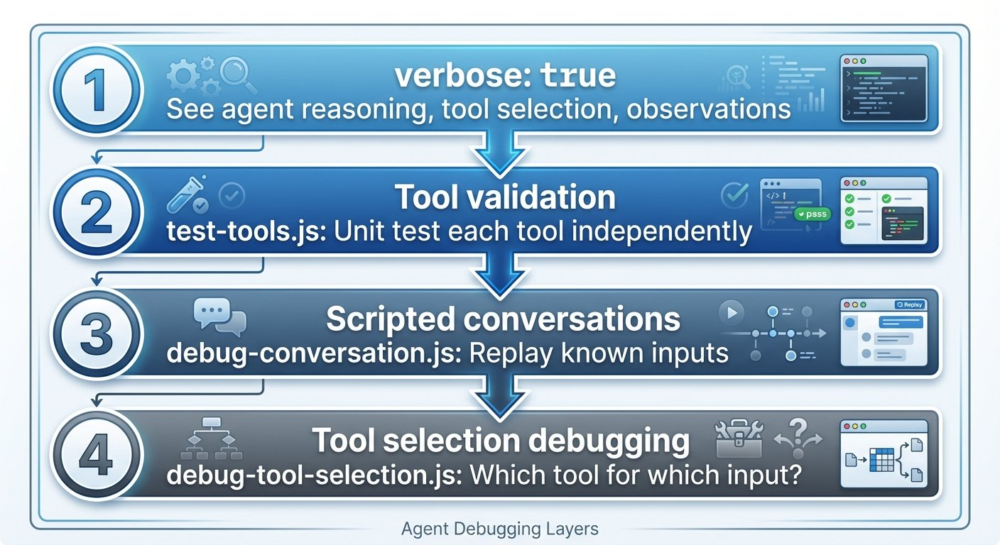

# Building an Agentic Personal Trainer - Part 8: Testing and Debugging Agents

*This is Part 8 of a series on building an agentic personal trainer. Read [Part 1](https://www.mosaicmeshai.com/blog/building-an-agentic-personal-trainer-part-1-architecture-and-philosophy) for architecture, [Part 2](https://www.mosaicmeshai.com/blog/building-an-agentic-personal-trainer-part-2-the-tool-system) for tools, [Part 3](https://www.mosaicmeshai.com/blog/building-an-agentic-personal-trainer-part-3-the-system-prompt) for the system prompt, [Part 4](https://www.mosaicmeshai.com/blog/building-an-agentic-personal-trainer-part-4-garmin-integration) for Garmin integration, [Part 5](https://www.mosaicmeshai.com/blog/building-an-agentic-personal-trainer-part-5-smart-duplicate-detection) for duplicate detection, [Part 6](https://www.mosaicmeshai.com/blog/building-an-agentic-personal-trainer-part-6-memory-and-learning) for memory, and [Part 7](https://www.mosaicmeshai.com/blog/building-an-agentic-personal-trainer-part-7-llm-provider-abstraction) for LLM provider abstraction.*

## The Hook

How do you test an AI agent? Unit tests don't cover "it gave bad advice." Verbose mode became my best debugging tool—watching the agent think out loud.

## The Story

LangChain's `verbose: true` flag transforms debugging. Instead of black-box responses, you see every reasoning step ([trainer-agent.js:79-83](https://github.com/bart-mosaicmeshai/agentic-personal-trainer/blob/main/src/agent/trainer-agent.js#L79-L83)):

```javascript
const agent = await initializeAgentExecutorWithOptions(tools, llm, {
  agentType: "chat-conversational-react-description",
  memory,
  verbose: true,  // Set to true for debugging, false for clean output
});
```



*Four layers of agent debugging: verbose mode, tool validation, scripted conversations, and tool selection analysis*

With verbose mode on, I can see exactly why the agent picked a tool:

```
Agent: I should check for injuries before suggesting a workout.
Action: get_active_injuries
Observation: Active injuries: Left knee (moderate): Affects run, hike
Agent: Given the knee injury, I'll suggest low-impact options...
```

Tool validation came next with `test-tools.js` ([scripts/test-tools.js](https://github.com/bart-mosaicmeshai/agentic-personal-trainer/blob/main/src/scripts/test-tools.js)) to test each tool in isolation. LangChain tools use `.invoke()`, not `.func()`:

```javascript
async function runTest(name, tool, input, validator) {
  const result = await tool.invoke(input);
  const testPassed = validator(result);
  console.log(testPassed ? `✅ ${name}` : `❌ ${name}`);
}

// Example: Test workout suggestion tool
await runTest(
  'suggest_workout - returns recovery options when tired',
  suggestWorkoutTool,
  JSON.stringify({ feeling: 'tired', duration_minutes: 60 }),
  (result) => result.includes('Workout suggestions:')
);
```

But unit tests only validate tools in isolation. The hardest bugs aren't crashes—they're the agent making reasonable-sounding but wrong decisions. "Suggest a hard interval workout" when the athlete just logged a race yesterday.

Testing agent behavior requires scripted conversations using LangChain's `BaseCallbackHandler` to track which tools get called ([scripts/debug-conversation.js](https://github.com/bart-mosaicmeshai/agentic-personal-trainer/blob/main/src/scripts/debug-conversation.js)):

```javascript
class ToolCallTracker extends BaseCallbackHandler {
  name = "tool_call_tracker";
  toolCalls = [];

  handleToolStart(tool, input) {
    this.toolCalls.push({ tool: tool.name, input });
  }
}

const scenarios = [
  { name: "Injury awareness",
    input: "Do I have any injuries I should know about?",
    expectTools: ["get_active_injuries"] },
  { name: "Workout suggestion request",
    input: "I have 2 hours and feel great, what should I do?",
    expectTools: ["suggest_workout"] }
];
```

Building this infrastructure uncovered the first bug: the tools were initially defined using LangChain's `Tool` class, but kept failing with cryptic errors. The fix: switch to `DynamicTool` with string coercion ([trainer-agent.js:14-24](https://github.com/bart-mosaicmeshai/agentic-personal-trainer/blob/main/src/agent/trainer-agent.js#L14-L24)):

```javascript
function wrapToolWithStringCoercion(tool) {
  return new DynamicTool({
    name: tool.name,
    description: tool.description,
    func: async (input) => {
      const stringInput = typeof input === 'string' ? input : JSON.stringify(input);
      return tool.invoke(stringInput);
    }
  });
}
```

Local LLMs sometimes send numbers instead of strings. Without this test-driven discovery, it would have been a confusing runtime error.

Next, running the scripted tests revealed a second bug: all 6 scenarios failed with "Tools called: none"—even though the agent was clearly answering correctly using tool data. The callback handler wasn't being registered with the agent executor. After fixing the callback registration, all tests passed:

```
✅ PASSED: Correctly called get_active_injuries
✅ PASSED: Correctly called get_recent_workouts
✅ PASSED: Correctly called suggest_workout
✅ PASSED: Correctly called get_planned_schedule
✅ PASSED: Correctly called add_planned_workout
✅ PASSED: Called relevant tool: suggest_brick_workout

Test Summary: Passed: 6, Failed: 0, Total: 6
```

The fourth debugging layer is `debug-tool-selection.js` ([scripts/debug-tool-selection.js](https://github.com/bart-mosaicmeshai/agentic-personal-trainer/blob/main/src/scripts/debug-tool-selection.js)) for ad-hoc investigation of specific prompts. It shows exactly what the LLM sees, what it decides, and why:

```
Prompt: "I have 2 hours and feel great, what should I do?"

🤖 LLM Response:
{
  "action": "suggest_workout",
  "action_input": "{\"feeling\": \"great\", \"duration_minutes\": 120}"
}

🔧 Tool Selected: suggest_workout
   Tool Input: {"feeling": "great", "duration_minutes": 120}
   Output: Workout suggestions:
   1. Based on your criteria, I suggest checking with the athlete
      about their preferences.

Final Response: Based on your feeling great and having 2 hours,
I suggest checking with you about your workout preferences to give
a more tailored suggestion.
```

The tool traces the full reasoning chain: LLM request → tool selection → tool output → final answer. Essential for debugging "why didn't it use the tool I expected?"

## The Reflection

[Agent debugging](https://python.langchain.com/docs/how_to/debugging/) is fundamentally different from traditional debugging. You're not looking for crashes—you're looking for bad judgment. The agent that confidently gives terrible advice is harder to catch than the one that throws an error.

Verbose mode should be on during all development. The performance cost is worth it. When something goes wrong, you need to see the reasoning chain, not just the output.

Next: lessons learned from building this whole system.

---

**Part 8 of 9** in the Agentic Personal Trainer series.

---

## Project

**agentic-personal-trainer** - [View on GitHub](https://github.com/bart-mosaicmeshai/agentic-personal-trainer)

---

## Meta

- **Category**: Measuring (Testing and quality)
- **Project**: agentic-personal-trainer
- **Word count target**: 150-300 words
- **Writing time**: ~15-20 minutes
- **Inspiration**: Simon Willison's daily blog, Seth Godin's short posts

## Publishing Checklist

- [ ] Hook is compelling and specific
- [ ] Story shows real work, not just summary
- [ ] Reflection adds insight or learning
- [ ] Post is 150-300 words
- [ ] Code examples (if any) are formatted and explained
- [ ] GitHub links to specific code lines
- [ ] Image generated and added
- [ ] ASCII diagrams removed (kept only as image reference)
- [ ] Links to relevant resources
- [ ] Proofread for typos
- [ ] Update published: true in frontmatter

---

*This post is part of my daily AI journey blog at [Mosaic Mesh AI](https://www.mosaicmeshai.com/blog). Building in public, learning in public, sharing the messy middle of AI development.*
