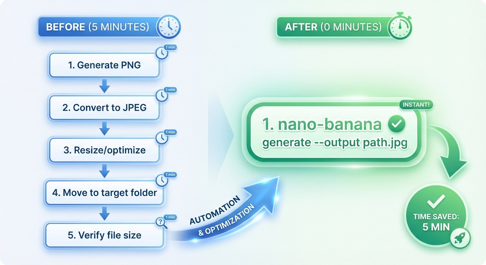

# Removing Friction: Automating Nano Banana Image Workflows

## The Hook

Five minutes of manual work for every blog image—convert PNG to JPEG, resize, move to the right folder. While generating images for a 9-part blog series, I'd had enough. Twenty minutes of coding eliminated the friction.

## The Story

My `nano-banana` CLI ([introduced when I added model 3 support](https://www.mosaicmeshai.com/blog/adding-nano-banana-3-support-to-my-cli-wrapper)) generates images from Gemini's API. But the workflow had manual friction:

**The old way (5 minutes):**
1. Run `nano-banana generate "prompt" --model 3 --resolution 1K`
2. PNG saved to `output/2025-12-15/generated_v3_1K_timestamp.png`
3. Open PNG in Preview, export as JPEG with compression
4. Move JPEG to `~/Projects/blog/assets/series-name/image-name.jpg`
5. Verify file size is reasonable for web

**What I wanted (0 minutes):**
1. Run `nano-banana generate "prompt" --output ~/Projects/blog/assets/series-name/image-name.jpg --model 3 --resolution 1K`
2. Done.



*Before: 5-step manual workflow. After: Single automated command.*

I opened a separate Claude Code session, told it to read [`AUTOMATED_JPEG_OUTPUT_ENHANCEMENT.md`](https://github.com/bart-mosaicmeshai/nano-banana-experiments/blob/main/AUTOMATED_JPEG_OUTPUT_ENHANCEMENT.md) in the nano-banana repo, and let it implement the changes. Twenty minutes later, tested and working.

The new workflow in action generating Part 7 of the Agentic Personal Trainer series:

```bash
nano-banana generate "A clean technical diagram showing LLM provider abstraction..." \
  --output ~/Projects/mosaic-mesh-ai-blog/assets/agentic-personal-trainer/agentic-personal-trainer-part-7.jpg \
  --model 3 \
  --resolution 1K

# Output:
# JPEG image saved to: .../agentic-personal-trainer-part-7.jpg (quality: 85)
# Total cost: $0.134000
```

One command. No manual steps. Image saved exactly where I need it, optimized for web.

Better yet: [Claude Code](https://github.com/bart-mosaicmeshai/mosaic-mesh-ai-blog) (my AI writing partner) runs this command directly during our editing sessions. I don't even have to switch terminal windows—Claude generates the image, I verify it looks good, and we move on to the next part. The human work went from 5 minutes per image to ~10 seconds of review.

### The Implementation

Three key changes ([cli.py](https://github.com/bart-mosaicmeshai/nano-banana-experiments/blob/main/nano_banana/cli.py)):

**1. Detect output format from file extension:**
```python
output_path = Path(output).expanduser()
is_jpeg = output_path.suffix.lower() in ['.jpg', '.jpeg']
```

**2. Add quality control:**
```python
@click.option('--quality', type=click.IntRange(1, 100), default=85,
              help='JPEG quality (1-100, default: 85)')
```

**3. Convert and optimize on save:**
```python
if is_jpeg:
    # Convert RGBA to RGB for JPEG compatibility
    if img_data.mode in ('RGBA', 'LA'):
        rgb_image = Image.new('RGB', img_data.size, (255, 255, 255))
        rgb_image.paste(img_data, mask=img_data.split()[-1])
        img_data = rgb_image

    # Save as optimized JPEG with metadata in comment field
    img_data.save(output_path, 'JPEG', quality=quality, optimize=True)
```

Metadata goes in the JPEG comment field as JSON. Path expansion and parent directory creation happen automatically.

## The Reflection

**The ROI math:** 20 minutes to build, 5 minutes saved per image. Break-even at 4 images. I hit break-even generating the image for *this very blog post* (image #4). Everything after is pure time savings.

Three images generated for the [Agentic Personal Trainer series](https://www.mosaicmeshai.com/blog/building-an-agentic-personal-trainer-part-1-architecture-and-philosophy) (Parts 7-9) saved 15 minutes. Every future blog post image saves another 5 minutes. Over a year of daily blogging, that's **30+ hours saved**—nearly a full work week of time reclaimed.

But the real win isn't time—it's removing the decision fatigue. Before: "Do I generate an image or skip it because of the manual work?" After: "Generate the image." Friction removed, creativity unblocked.

**Building tools for yourself:** When you're both the builder and the user, you know exactly what hurts. No stakeholder meetings, no requirements doc, no prioritization debates. Just fix the thing that's annoying.

**Incremental improvements compound:** This built on the [nano-banana 3 support](https://www.mosaicmeshai.com/blog/adding-nano-banana-3-support) from November. Each enhancement makes the next one easier.

Next time you catch yourself doing the same manual task for the 10th time—automate it. Twenty minutes now, hours saved later.

---

**Project: nano-banana-experiments** - [View on GitHub](https://github.com/bart-mosaicmeshai/nano-banana-experiments)

---

## Meta

- **Category**: Building (Creating workflow improvements)
- **Project**: nano-banana-experiments
- **Implementation time**: 20 minutes (separate Claude Code agent)
- **Time saved per use**: 5 minutes
- **Break-even**: 4 images
- **Inspiration**: Daily friction from blog image generation

## Publishing Checklist

- [ ] Hook is compelling and specific
- [ ] Story shows real work, not just summary
- [ ] Reflection adds insight or learning
- [ ] Code examples formatted and explained
- [ ] GitHub links to actual code
- [ ] Image generated and added
- [ ] Links to related posts (nano-banana 3, agentic trainer series)
- [ ] Proofread for typos
- [ ] Update published: true in frontmatter

---

*This post is part of my daily AI journey blog at [Mosaic Mesh AI](https://www.mosaicmeshai.com/blog). Building in public, learning in public, sharing the messy middle of AI development.*
