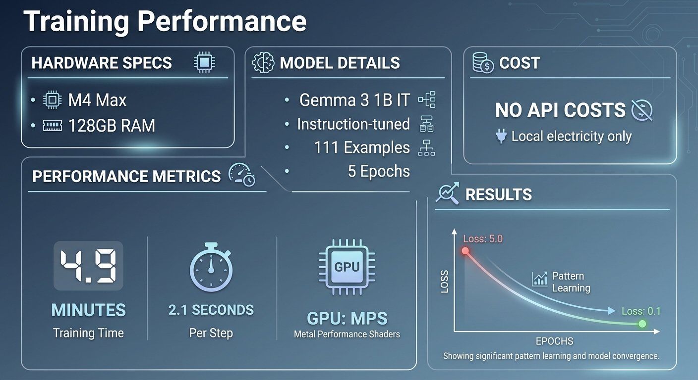
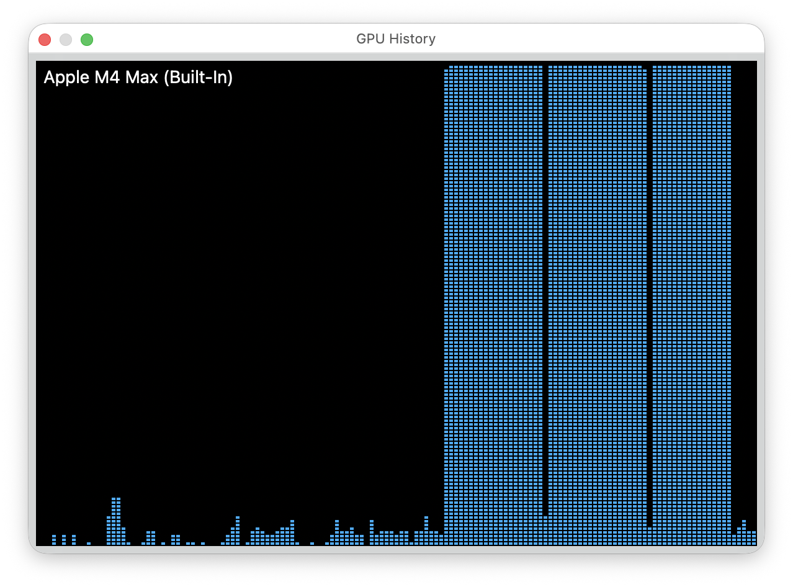

# Fine-Tuning Gemma for Personality - Part 3: Training on Apple Silicon

*This is Part 3 of a series on fine-tuning Gemma for personality. Read [Part 1](https://www.mosaicmeshai.com/blog/fine-tuning-gemma-for-personality-part-1-why-fine-tune-a-six-year-old) for the concept and [Part 2](https://www.mosaicmeshai.com/blog/fine-tuning-gemma-for-personality-part-2-building-the-training-dataset) for the dataset.*

## The Hook

Five minutes and no API costs to fine-tune a 1 billion parameter language model on my laptop. No cloud GPUs, no monthly fees, no time limits. Just Apple Silicon and PyTorch.

## The Story

PyTorch supports Apple's Metal Performance Shaders (MPS) backend—GPU acceleration on M-series chips. The training script ([train_bluey_1b_it.py](https://github.com/bart-mosaicmeshai/gemma-local-finetune/blob/main/src/train/train_bluey_1b_it.py)) automatically detects and uses it:

```python
from config import TrainingConfig

config = TrainingConfig(
    model_name='google/gemma-3-1b-it',
    dataset_path='datasets/bluey_training.jsonl.txt',
    num_train_epochs=5,
    per_device_train_batch_size=4,
    learning_rate=5e-5,
    use_mps=True  # Apple Silicon GPU
)
```



Training 111 examples over 5 epochs took **4.9 minutes** for the 1B model. The loss dropped from 5.0 to 0.1—the model learned the training data well. Too well, as it turned out (more on that in Part 4).

Training times varied by model size on the M4 Max with 128GB RAM:
- **270M model**: ~1.6 minutes
- **1B model**: ~4.9 minutes

Activity Monitor showed the training process using 41GB RAM with 96.5% GPU utilization—the MPS backend pushed the GPU hard while leaving plenty of memory headroom in the 128GB pool. Battery drained 10% during the 5-minute training run, showing the real power consumption of local GPU-accelerated fine-tuning.



## The Reflection

Cloud GPU notebooks (Colab, SageMaker) charge per hour and disconnect when idle. Local training has none of those constraints. Five-minute experiments have no API costs. Ten failed experiments still have no cloud fees.

This M4 Max with 128GB RAM wasn't cheap, but it unlocks these use cases. No cloud service fees, no API costs, data stays private. I ran this training while sitting in a high school cafeteria waiting for my daughter's basketball game to start. That's the advantage of local ML—your laptop, your data, your experiments, anywhere.

Next: the problems that emerged when the model worked *too* well.

---

**Part 3 of 9** in the Fine-Tuning Gemma for Personality series.

---

## Project

**gemma-local-finetune** - [View on GitHub](https://github.com/bart-mosaicmeshai/gemma-local-finetune)

---

## Meta

- **Category**: Building (Creating something new)
- **Project**: gemma-local-finetune
- **Word count target**: 150-300 words
- **Writing time**: ~15-20 minutes

## Publishing Checklist

- [ ] Hook is compelling and specific
- [ ] Story shows real work, not just summary
- [ ] Reflection adds insight or learning
- [ ] Post is 150-300 words
- [ ] Code examples (if any) are formatted and explained
- [ ] GitHub links to specific code lines
- [ ] Image generated and added
- [ ] ASCII diagrams removed (kept only as image reference)
- [ ] Links to relevant resources
- [ ] Proofread for typos
- [ ] Update published: true in frontmatter

---

*This post is part of my AI journey blog at [Mosaic Mesh AI](https://www.mosaicmeshai.com/blog). Building in public, learning in public, sharing the messy middle of AI development.*
