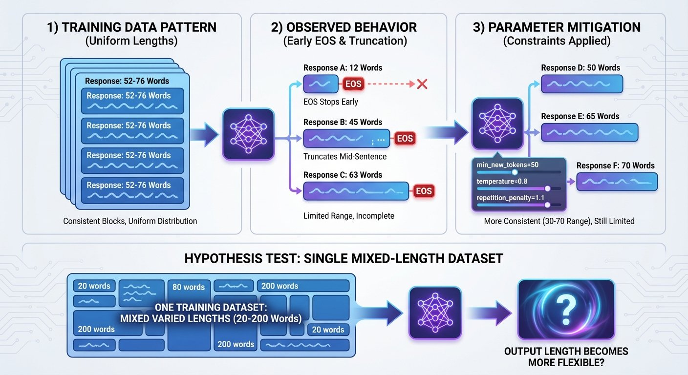

# Fine-Tuning Gemma for Personality - Part 4: When Your Model Learns Too Well

*This is Part 4 of a series on fine-tuning Gemma for personality. Read [Part 1](https://www.mosaicmeshai.com/blog/fine-tuning-gemma-for-personality-part-1-why-fine-tune-a-six-year-old) for the concept, [Part 2](https://www.mosaicmeshai.com/blog/fine-tuning-gemma-for-personality-part-2-building-the-training-dataset) for the dataset, and [Part 3](https://www.mosaicmeshai.com/blog/fine-tuning-gemma-for-personality-part-3-training-on-apple-silicon) for training on Apple Silicon.*

## The Hook

The model reproduced Bluey's speech patterns. Then it stopped generating after 76 words. The training data's average response length may have become a constraint.

## The Story

After training, I tested the model with: "Tell me about your family."

Expected: A detailed, enthusiastic response about Mum, Dad, and Bingo.

Got: Responses ranging from 12-63 words, often cutting off mid-sentence. The model hit the EOS (end-of-sequence) token early, even with `max_new_tokens=400`.



A possible cause: the training data averaged 52-76 words per response. The model may have learned that pattern as "correct response length."

**One mitigation approach: generation parameter tuning** ([test_min_tokens_fix.py](https://github.com/bart-mosaicmeshai/gemma-local-finetune/blob/main/src/test/test_min_tokens_fix.py)):

```python
response = model.generate(
    prompt,
    max_new_tokens=400,
    min_new_tokens=50,      # Prevent very short responses
    temperature=0.8,         # Balanced creativity
    top_p=0.95,
    top_k=50,
    repetition_penalty=1.1,  # Reduce loops
    do_sample=True
)
```

`min_new_tokens=50` prevents the model from stopping early. `temperature=0.8` encourages variation. `repetition_penalty=1.1` reduces phrase loops.

These parameters helped reduce the variability—responses became more consistent, avoiding the extremely short 12-word outputs. But most responses still stayed in the 30-70 word range rather than expanding to longer, complete thoughts.

To test this hypothesis, you'd need to fine-tune again with deliberately varied response lengths (30-200 words) in the training data and compare the results.

## The Reflection

Overfitting is usually bad. For personality capture, it can be a useful feature. You *want* the model to internalize Bluey's patterns. But you don't want it to learn unintended constraints like response length.

The lesson: training data patterns may matter as much as content. If all your examples are 52-76 words, the model may learn that as "correct." Generation parameters can mitigate this but may not fully override it. One approach to test: vary response lengths deliberately in your training data from the start and compare the results.

Next: comparing base models vs instruction-tuned models for personality consistency.

---

**Part 4 of 8** in the Fine-Tuning Gemma for Personality series.

---

## Project

**gemma-local-finetune** - [View on GitHub](https://github.com/bart-mosaicmeshai/gemma-local-finetune)

---

## Meta

- **Category**: Breaking (Debugging and fixing)
- **Project**: gemma-local-finetune
- **Word count target**: 150-300 words
- **Writing time**: ~15-20 minutes

## Publishing Checklist

- [ ] Hook is compelling and specific
- [ ] Story shows real work, not just summary
- [ ] Reflection adds insight or learning
- [ ] Post is 150-300 words
- [ ] Code examples (if any) are formatted and explained
- [ ] GitHub links to specific code lines
- [ ] Image generated and added
- [ ] ASCII diagrams removed (kept only as image reference)
- [ ] Links to relevant resources
- [ ] Proofread for typos
- [ ] Update published: true in frontmatter

---

*This post is part of my AI journey blog at [Mosaic Mesh AI](https://www.mosaicmeshai.com/blog). Building in public, learning in public, sharing the messy middle of AI development.*
