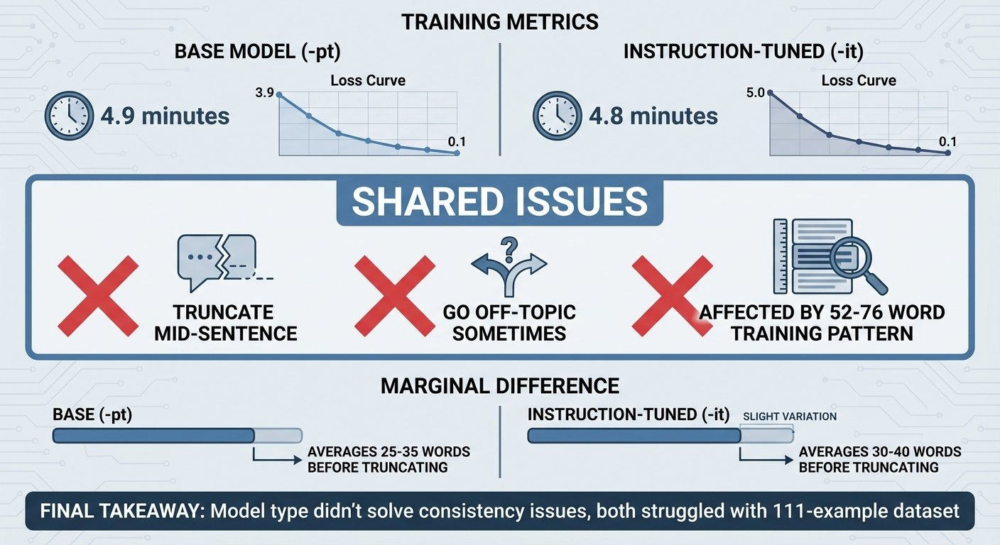

# Fine-Tuning Gemma for Personality - Part 5: Base Models vs Instruction-Tuned

*This is Part 5 of a series on fine-tuning Gemma for personality. Read [Part 1](https://www.mosaicmeshai.com/blog/fine-tuning-gemma-for-personality-part-1-why-fine-tune-a-six-year-old) for the concept, [Part 2](https://www.mosaicmeshai.com/blog/fine-tuning-gemma-for-personality-part-2-building-the-training-dataset) for the dataset, [Part 3](https://www.mosaicmeshai.com/blog/fine-tuning-gemma-for-personality-part-3-training-on-apple-silicon) for training, and [Part 4](https://www.mosaicmeshai.com/blog/fine-tuning-gemma-for-personality-part-4-when-your-model-learns-too-well) for the short response problem.*

## The Hook

Same training data. Same hardware. Same 5 minutes. I tested both base (-pt) and instruction-tuned (-it) models to see if one would handle personality better. Both struggled with consistency.

## The Story

Gemma models come in [two flavors](https://huggingface.co/collections/google/gemma-2-release-667d6600fd5220e7b967f315):
- **Pre-trained (-pt)**: Base models trained on text continuation
- **Instruction-tuned (-it)**: Further trained to follow conversational patterns

I ran the same Bluey dataset through both [gemma-3-1b-pt](https://huggingface.co/google/gemma-3-1b-pt) and [gemma-3-1b-it](https://huggingface.co/google/gemma-3-1b-it).

Training time was nearly identical (4.9 vs 4.8 minutes). Both models reduced loss significantly (ending around 0.1). I tested both with the same prompts to see if model type made a difference.

**What I found:** Both models showed inconsistent behavior. Sometimes on-topic with Bluey's voice, sometimes off-topic but still in Bluey's voice, both truncating mid-sentence.

**Example - "Can you help me with my homework?":**

Base model (-pt):
> "Yeah! That's fair, even though sometimes I don't understand. What kind of homework is it? Is it maths? Because Mum's really good at maths. Or maybe" (26 words, truncated)

Instruction-tuned (-it):
> "Homework is actually pretty fun if you make it into a game! So I'm happy to help you with your homework. Just remember - if it gets too hard, you can take a break and play for a bit. That's" (40 words, truncated)

Both show Bluey patterns. The -it response is longer, but both cut off mid-sentence. Across four different test prompts, both models went off-topic sometimes and stayed on-topic other times.

**See all test cases:** [pt_vs_it_comparison.txt](https://github.com/bart-mosaicmeshai/gemma-local-finetune/blob/main/src/logs/pt_vs_it_comparison.txt) shows all four prompts and responses. Run [compare_pt_vs_it.py](https://github.com/bart-mosaicmeshai/gemma-local-finetune/blob/main/src/test/compare_pt_vs_it.py) to reproduce these results.

## The Reflection

The theory: instruction-tuned models are pre-trained on conversational patterns, so they should handle personality fine-tuning better with limited data.

The reality: both models struggled. Both went off-topic sometimes. Both truncated responses. Both reproduced Bluey patterns inconsistently.

The marginal difference: the `-it` model produced slightly longer responses before truncating (30-40 words vs 25-35 words). But "longer" doesn't mean "better" when both are cutting off mid-sentence.

With only 111 examples, neither model type solved the consistency problem. The training data limitations affected both equally.

Next: how to test personality (you can't unit test "sounds like Bluey").

---

**Part 5 of 9** in the Fine-Tuning Gemma for Personality series.

---

## Project

**gemma-local-finetune** - [View on GitHub](https://github.com/bart-mosaicmeshai/gemma-local-finetune)

---

## Meta

- **Category**: Measuring (Testing and comparison)
- **Project**: gemma-local-finetune
- **Word count target**: 150-300 words
- **Writing time**: ~15-20 minutes

## Publishing Checklist

- [ ] Hook is compelling and specific
- [ ] Story shows real work, not just summary
- [ ] Reflection adds insight or learning
- [ ] Post is 150-300 words
- [ ] Code examples (if any) are formatted and explained
- [ ] GitHub links to specific code lines
- [ ] Image generated and added
- [ ] ASCII diagrams removed (kept only as image reference)
- [ ] Links to relevant resources
- [ ] Proofread for typos
- [ ] Update published: true in frontmatter

---

*This post is part of my AI journey blog at [Mosaic Mesh AI](https://www.mosaicmeshai.com/blog). Building in public, learning in public, sharing the messy middle of AI development.*
