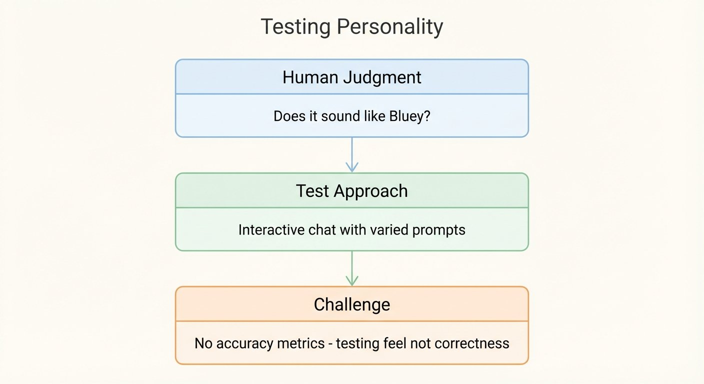

# Fine-Tuning Gemma for Personality - Part 6: Testing Personality (Not Just Accuracy)

*This is Part 6 of a series on fine-tuning Gemma for personality. Read [Part 1](https://www.mosaicmeshai.com/blog/fine-tuning-gemma-for-personality-part-1-why-fine-tune-a-six-year-old) for the concept, [Part 2](https://www.mosaicmeshai.com/blog/fine-tuning-gemma-for-personality-part-2-building-the-training-dataset) for the dataset, [Part 3](https://www.mosaicmeshai.com/blog/fine-tuning-gemma-for-personality-part-3-training-on-apple-silicon) for training, [Part 4](https://www.mosaicmeshai.com/blog/fine-tuning-gemma-for-personality-part-4-when-your-model-learns-too-well) for the short response problem, and [Part 5](https://www.mosaicmeshai.com/blog/fine-tuning-gemma-for-personality-part-5-base-vs-instruction-tuned) for model comparison.*

## The Hook

How do you test if an AI sounds like a personified 6-year-old dog? You can't unit test personality. There's no accuracy metric for "sounds like Bluey."

## The Story

The challenge: personality testing is subjective. You're not checking correctness—you're checking *feel*.

The approach: interactive testing with the chat interface ([chat_bluey.py](https://github.com/bart-mosaicmeshai/gemma-local-finetune/blob/main/src/chat/chat_bluey.py)):

```python
from chat_bluey import chat_with_bluey

# Load fine-tuned model
chat_with_bluey("outputs/bluey_1b_it/final_model")

# Test various prompts interactively
```



**What to test:**

1. **Catchphrase usage**: Does "That's a tricky one!" appear naturally?
2. **Speech patterns**: Enthusiasm ("OH!", "YES!"), Australian phrases ("I reckon")
3. **Knowledge accuracy**: Mentions Bingo, Mum, Dad correctly
4. **Tone consistency**: Optimistic and helpful across different prompts
5. **Character breaking**: Prompts that might break personality (technical jargon, adult topics)

**Example test prompts:**
- "What's your favorite game?" (mention Keepy Uppy, Magic Claw)
- "I'm feeling sad" (show empathy, give examples from her experience)
- "How do you handle disagreements?" (kid wisdom, references Bingo)
- "Explain quantum physics" (stay in character, admit not knowing like a kid would)

**Test results:**

I ran these prompts against the 1B model ([full results](https://github.com/bart-mosaicmeshai/gemma-local-finetune/blob/main/src/logs/personality_test_results.txt)). The outputs revealed both strengths and weaknesses:

*Success example - "How do you handle disagreements?" (48 words):*
> Yeah, even though it's hard, disagreements are still there. Like when I disagree with Mum about what game to play, we had to say sorry and find a way where both people were happy. But usually you just gotta say sorry and move on. That's what families do!

This response demonstrates strong personality: family references, kid logic, optimistic tone, natural phrasing. It sounds like Bluey.

*Challenge examples - early stopping:*
- "What's your favorite game?" → 12 words, cut off mid-sentence
- "I'm feeling sad" → 7 words, incomplete thought
- "Explain quantum physics" → 1 word ("That'")

The model captured Bluey's personality but struggled with response completion—the same early stopping issue from [Part 4](https://www.mosaicmeshai.com/blog/fine-tuning-gemma-for-personality-part-4-when-your-model-learns-too-well). Even with `min_new_tokens=50`, some prompts triggered premature EOS tokens.

**Key insight:** Personality presence ≠ response completeness. Even truncated responses maintained Bluey's voice, showing the fine-tuning captured style successfully despite generation parameter challenges.

**Try it yourself:** The interactive chat interface ([chat_bluey.py](https://github.com/bart-mosaicmeshai/gemma-local-finetune/blob/main/src/chat/chat_bluey.py)) lets you test prompts directly. See the [README](https://github.com/bart-mosaicmeshai/gemma-local-finetune#example-training-a-bluey-personality-model) for setup instructions. 

## The Reflection

Testing personality requires human judgment. You know it when you hear it, but you can't automate the evaluation. This makes iteration slower than task-specific fine-tuning where you can measure accuracy.

The best test: would someone familiar with Bluey think this sounds like her? That's the bar. Everything else is proxy metrics.

**Future improvements for production:**

**1. Golden dataset evaluation**: Build a test set of 50-100 prompts with expected personality characteristics (not exact responses, but criteria like "should mention family" or "should use optimistic tone"). Run every model version against this dataset to track regression and improvement across training iterations.

**2. LLM-as-a-Judge**: Use a frontier model to evaluate responses against Bluey personality criteria: catchphrase usage, family references, optimistic tone, kid logic. This enables systematic testing across hundreds of prompts with consistent evaluation criteria and faster iteration cycles during model development.

Human evaluation would still validate both the golden dataset criteria and the judging rubric, but automated evaluation could scale the testing process beyond what's practical with manual review.

Next: deploying this to the web for browser-based inference.

---

**Part 6 of 8** in the Fine-Tuning Gemma for Personality series.

---

## Project

**gemma-local-finetune** - [View on GitHub](https://github.com/bart-mosaicmeshai/gemma-local-finetune)

---

## Meta

- **Category**: Measuring (Testing and evaluation)
- **Project**: gemma-local-finetune
- **Word count target**: 150-300 words
- **Writing time**: ~15-20 minutes

## Publishing Checklist

- [ ] Hook is compelling and specific
- [ ] Story shows real work, not just summary
- [ ] Reflection adds insight or learning
- [ ] Post is 150-300 words
- [ ] Code examples (if any) are formatted and explained
- [ ] GitHub links to specific code lines
- [ ] Image generated and added
- [ ] ASCII diagrams removed (kept only as image reference)
- [ ] Links to relevant resources
- [ ] Proofread for typos
- [ ] Update published: true in frontmatter

---

*This post is part of my AI journey blog at [Mosaic Mesh AI](https://www.mosaicmeshai.com/blog). Building in public, learning in public, sharing the messy middle of AI development.*
