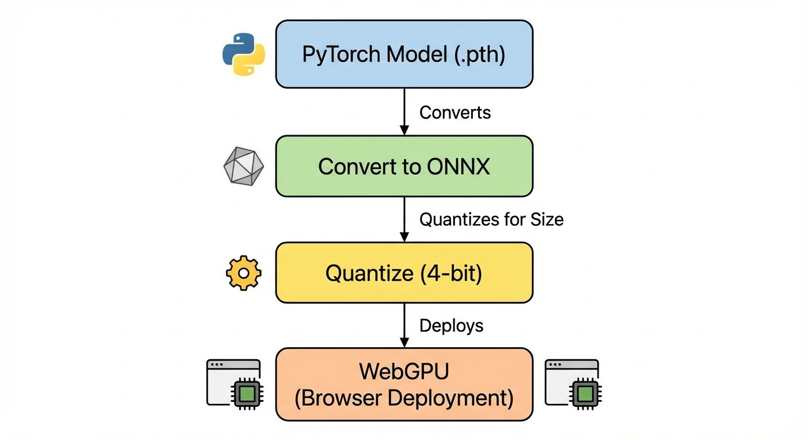

# Fine-Tuning Gemma for Personality - Part 7: From PyTorch to Browser

*This is Part 7 of a series on fine-tuning Gemma for personality. Read [Part 1](https://www.mosaicmeshai.com/blog/fine-tuning-gemma-for-personality-part-1-why-fine-tune-a-six-year-old) for the concept, [Part 2](https://www.mosaicmeshai.com/blog/fine-tuning-gemma-for-personality-part-2-building-the-training-dataset) for the dataset, [Part 3](https://www.mosaicmeshai.com/blog/fine-tuning-gemma-for-personality-part-3-training-on-apple-silicon) for training, [Part 4](https://www.mosaicmeshai.com/blog/fine-tuning-gemma-for-personality-part-4-when-your-model-learns-too-well) for challenges, [Part 5](https://www.mosaicmeshai.com/blog/fine-tuning-gemma-for-personality-part-5-base-vs-instruction-tuned) for model comparison, and [Part 6](https://www.mosaicmeshai.com/blog/fine-tuning-gemma-for-personality-part-6-testing-personality) for testing.*

## The Hook

Browser-based inference with a fine-tuned model. No backend server, no API keys, no monthly fees. Just client-side WebGPU running entirely on your device.

## The Story

I wanted to see if browser deployment was possible with a fine-tuned model. I'd seen browser-based ML demos like the [Bedtime Story Generator](https://huggingface.co/spaces/webml-community/bedtime-story-generator) and was curious if the same approach would work with my Bluey model.

**Note:** While Parts 1-6 focused on training the 1B model, I deployed the smaller 270M variant for web use. The 270M model (764MB after quantization) provides better browser compatibility. The 1B model uses sliding window attention which isn't supported by Transformers.js 3.6.3, causing the ONNX Runtime to fail during session initialization.

Web deployment requires converting PyTorch models to ONNX format. The full pipeline is documented in [DEPLOYMENT.md](https://github.com/bart-mosaicmeshai/gemma-local-finetune/blob/main/DEPLOYMENT.md), but the key steps are:

1. Prepare the fine-tuned model in Transformers format
2. Convert to ONNX with 4-bit quantization (reduces size ~24%)
3. Deploy with Transformers.js + WebGPU in the browser

The conversion process uses external tooling to handle Gemma's architecture and apply quantization during export.

[Transformers.js](https://huggingface.co/docs/transformers.js) runs the model in-browser using WebGPU (or WASM fallback). The user loads the model once, then all inference happens locally. Conversations with Bluey never leave their device.

**Model size:**
- Original PyTorch (270M model): ~1.0GB
- Quantized ONNX (4-bit): ~764MB
- 24% reduction from 4-bit quantization

**Browser requirements:**
- Chrome 113+ or Edge 113+ (WebGPU support, 5-10 tokens/sec)
- Firefox 118+ and Safari 17+ (experimental WebGPU support)
- Fallback to WASM for other browsers (1-3 tokens/sec, slower but functional)

## The Reflection

Browser deployment isn't better than the CLI for my use case—it's just different. The CLI version with the 1B model is more coherent. But browser deployment opens different possibilities:

- **Sharing with non-technical users**: No Python installation, no terminal. Just a URL.
- **Demos and presentations**: "Here, try it yourself" beats showing screenshots.
- **Privacy-focused deployment**: Client-side inference means conversations never hit a server.
- **Educational value**: Showing that ML can run entirely in the browser.

Public web hosting changes the cost model. Instead of per-inference API costs, you pay for bandwidth to download the model (~764MB per new visitor). No backend servers to maintain, no rate limits. For this project, I ran everything locally on my machine, so I haven't incurred any hosting costs.

This deployment pattern worked for the 270M model and should work for other small models with full attention (not sliding window). The conversion pipeline is repeatable.

Next: what I'd do differently if I fine-tuned Bluey again.

---

**Part 7 of 9** in the Fine-Tuning Gemma for Personality series.

---

## Project

**gemma-local-finetune** - [View on GitHub](https://github.com/bart-mosaicmeshai/gemma-local-finetune)

---

## Meta

- **Category**: Building (Creating something new)
- **Project**: gemma-local-finetune
- **Word count target**: 150-300 words
- **Writing time**: ~15-20 minutes

## Publishing Checklist

- [ ] Hook is compelling and specific
- [ ] Story shows real work, not just summary
- [ ] Reflection adds insight or learning
- [ ] Post is 150-300 words
- [ ] Code examples (if any) are formatted and explained
- [ ] GitHub links to specific code lines
- [ ] Image generated and added
- [ ] ASCII diagrams removed (kept only as image reference)
- [ ] Links to relevant resources
- [ ] Proofread for typos
- [ ] Update published: true in frontmatter

---

*This post is part of my AI journey blog at [Mosaic Mesh AI](https://www.mosaicmeshai.com/blog). Building in public, learning in public, sharing the messy middle of AI development.*
