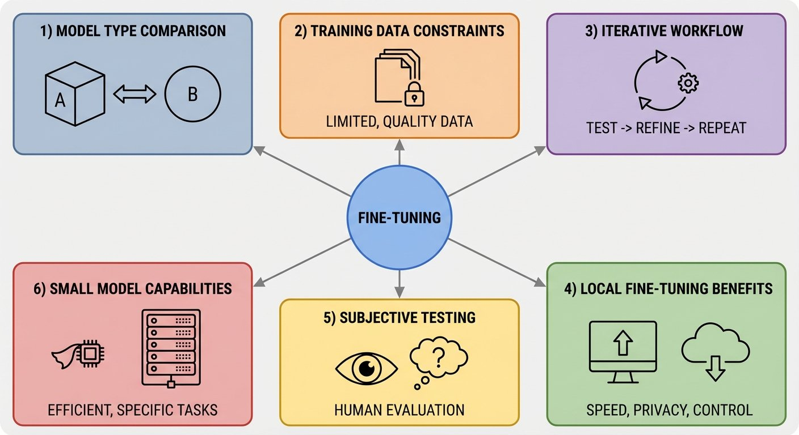

# Fine-Tuning Gemma for Personality - Part 8: Lessons Learned

*This is Part 8 of a series on fine-tuning Gemma for personality. Read [Part 1](https://www.mosaicmeshai.com/blog/fine-tuning-gemma-for-personality-part-1-why-fine-tune-a-six-year-old) for the concept, [Part 2](https://www.mosaicmeshai.com/blog/fine-tuning-gemma-for-personality-part-2-building-the-training-dataset) for the dataset, [Part 3](https://www.mosaicmeshai.com/blog/fine-tuning-gemma-for-personality-part-3-training-on-apple-silicon) for training, [Part 4](https://www.mosaicmeshai.com/blog/fine-tuning-gemma-for-personality-part-4-when-your-model-learns-too-well) for challenges, [Part 5](https://www.mosaicmeshai.com/blog/fine-tuning-gemma-for-personality-part-5-base-vs-instruction-tuned) for model comparison, [Part 6](https://www.mosaicmeshai.com/blog/fine-tuning-gemma-for-personality-part-6-testing-personality) for testing, and [Part 7](https://www.mosaicmeshai.com/blog/fine-tuning-gemma-for-personality-part-7-pytorch-to-browser) for web deployment.*

## The Hook

Eight posts about teaching an AI to talk like a cartoon dog. Here's what actually mattered.

## The Story

**1. Model type made minimal difference with limited data.** I tested both base (-pt) and instruction-tuned (-it) models with 111 examples. Both struggled with consistency, both went off-topic sometimes, both truncated. The `-it` model produced slightly longer responses (30-40 vs 25-35 words) but not meaningfully better results (see [Part 5](https://www.mosaicmeshai.com/blog/fine-tuning-gemma-for-personality-part-5-base-vs-instruction-tuned)).

**2. Training data patterns may become constraints.** Averaged 65-word responses (52-76 range)? The model may have learned that length as "correct." To test this hypothesis, you could vary response lengths deliberately in your training dataset and compare results (see [Part 4](https://www.mosaicmeshai.com/blog/fine-tuning-gemma-for-personality-part-4-when-your-model-learns-too-well)).

**3. Fine-tuning personality is iterative, not sequential.** I treated training and parameter tuning as separate steps: train the model, then adjust generation parameters. But they're interrelated, iterative processes. Testing parameters early reveals what the training data is actually teaching the model. `min_new_tokens`, `temperature`, `repetition_penalty` expose patterns (like learned response length constraints) that inform the next training iteration. The workflow is iterative: test parameters, adjust training data based on what you learn, retrain, repeat (see [Part 4](https://www.mosaicmeshai.com/blog/fine-tuning-gemma-for-personality-part-4-when-your-model-learns-too-well) for this cycle in action).

**4. Local fine-tuning unlocks experimentation.** Five-minute training cycles with no API costs meant trying variations freely. Cloud GPU time pressure kills iteration (see [Part 3](https://www.mosaicmeshai.com/blog/fine-tuning-gemma-for-personality-part-3-training-on-apple-silicon)).

**5. Personality testing is subjective.** No [BLEU score](https://en.wikipedia.org/wiki/BLEU) (automated text similarity metric), no accuracy percentage. Human judgment: "does this sound like Bluey?" Testing requires actual conversation, not automated eval (see [Part 6](https://www.mosaicmeshai.com/blog/fine-tuning-gemma-for-personality-part-6-testing-personality)).

**6. Small models can reproduce distinctive voice.** One billion parameters is enough to demonstrate personality-style learning. You don't need 70B models for character AI experiments. Start small, scale up only if needed.

## The Reflection

This was a learning prototype, not a production system. The goal was "can I fine-tune personality on Apple Silicon?" Answer: yes. The goal wasn't "can I build a flawless Bluey chatbot?"

The biggest surprise: how little data you need to demonstrate the approach. One hundred eleven examples isn't production-ready, but it's enough to show fine-tuning can work for conversational style.

The infrastructure matters more than the initial results. Now that training runs in 5 minutes locally, iteration is cheap. Want to try a different character? Different speech style? Just swap the dataset and retrain.

Apple Silicon changed the cost structure: I already owned the M4 Max with 128GB memory so using this machine allowed me the freedom of not worrying about per-experiment cloud fees resulting in lower friction for iteration.

**The core lesson holds: small models + good data + local training can demonstrate personality-style learning.**

---

**Part 8 of 8** in the Fine-Tuning Gemma for Personality series. Thanks for following along!

---

## Project

**gemma-local-finetune** - [View on GitHub](https://github.com/bart-mosaicmeshai/gemma-local-finetune)

---

## Meta

- **Category**: Learning (Exploring and experimenting)
- **Project**: gemma-local-finetune
- **Word count target**: 150-300 words
- **Writing time**: ~15-20 minutes

## Publishing Checklist

- [ ] Hook is compelling and specific
- [ ] Story shows real work, not just summary
- [ ] Reflection adds insight or learning
- [ ] Post is 150-300 words
- [ ] Code examples (if any) are formatted and explained
- [ ] GitHub links to specific code lines
- [ ] Image generated and added
- [ ] ASCII diagrams removed (kept only as image reference)
- [ ] Links to relevant resources
- [ ] Proofread for typos
- [ ] Update published: true in frontmatter

---

*This post is part of my AI journey blog at [Mosaic Mesh AI](https://www.mosaicmeshai.com/blog). Building in public, learning in public, sharing the messy middle of AI development.*
