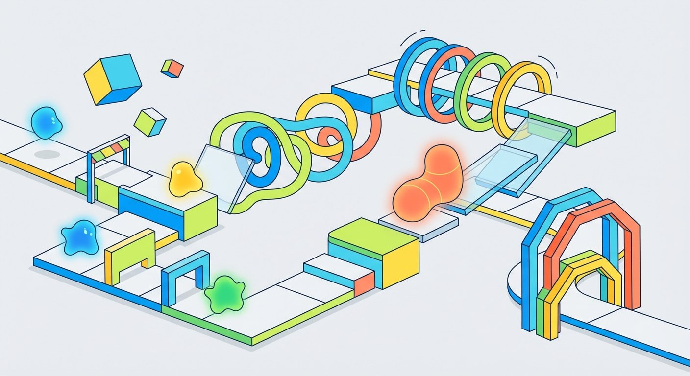
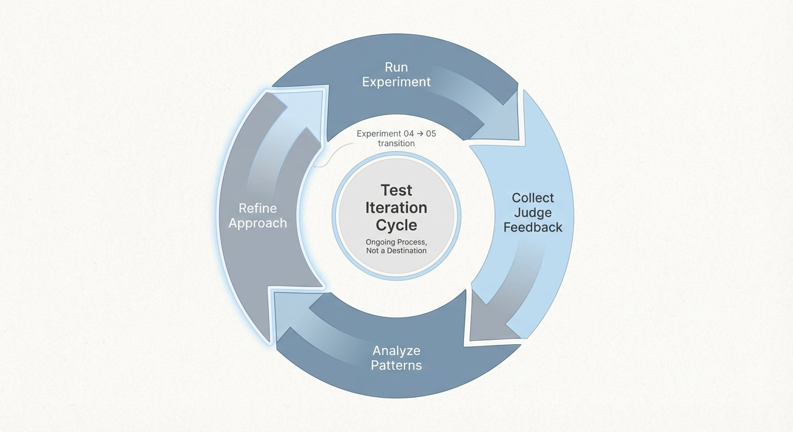

# The Bart Test - Part 6: The American Ninja Warrior Problem

*This is Part 6 of the Bart Test series. Read [Part 5](/blog/bart-test-part-5-redesigning-from-scratch) for the methodology redesign.*

## The Hook

The process validation from [Part 5](/blog/bart-test-part-5-redesigning-from-scratch) worked. Judges completed the paper sheets in about 10 minutes. They engaged with it. I got detailed feedback.

When I sat down to analyze the [completed ratings](https://github.com/bart-mosaicmeshai/bart-test/blob/main/evaluation_sheets/20251228/completed_ratings_20251228.json) from Experiment 04, the patterns were clear. But I realized I was at risk of misinterpreting what they meant.

## The Story

Before diving into the data, I need to be explicit about something—because it's surprisingly easy to slip into the wrong framing here.

**The goal of the Bart Test is NOT to find a prompt that makes every LLM score 10s across the board.**

Think about [American Ninja Warrior](https://en.wikipedia.org/wiki/American_Ninja_Warrior). If the producers made the course easy enough that every competitor sailed through every obstacle, the show would be useless for identifying the best athletes. Worse—it would be boring. The difficulty is what creates differentiation. The challenge is what makes it valuable.

The same principle applies to benchmarks. **If I refine the prompts until every LLM scores 8s, 9s, and 10s, I've made the test too easy.** It stops being useful for comparison. It stops revealing anything worth knowing.

The goal is to design a test that provides valuable insight into how different LLMs handle cultural fluency when presented with a difficult, consistent challenge. I want to see:
- How models compare to each other
- How they improve (or don't) over time
- What strategies they use and where they struggle

If every model gets perfect scores, the test tells me nothing.

With that framing clear, here's what Experiment 04 revealed:

**Pattern #1: Length**
> "No human Gen Alpha person writes such long posts" - Judge feedback

The prompt asked for 50-100 words. The actual outputs ranged 26-68 words. Most were criticized as too long—even the ones at the lower end of the range. Length alone signaled inauthenticity regardless of content quality.

**Pattern #2: Emoji Density**
> "No human uses so many emojis"

All models over-indexed on emoji usage. They heard "use emojis" and went maximum density. The judges spotted it immediately.

**Pattern #3: Formatting Differences**
The judges flagged model-specific quirks:
- Claude's separate paragraphs/lines felt wrong
- GPT's asterisks (`*action*`) were "weird"
- Llama treated group chat like a social media post ("in the comments below")

**The one that stood out:**
OLMo's Scenario B output ([26 words](https://github.com/bart-mosaicmeshai/bart-test/blob/main/results/04_final_outputs/olmo_scenario_b.json)) scored 10/9/10/7 from Judge #2 with the comment: "this would be something my friends would write, just without the 'AF'"

All other outputs ranged 27-68 words and were mostly criticized as too long.

**What this tells me:** The test is working. It's differentiating models. It's revealing patterns. OLMo's 26-word output shows it's *possible* to get this right, but it's clearly difficult. Most models struggle in different ways.

## The Reflection

The process mechanics worked. Paper sheets, batch evaluation, relatable scenarios—all improvements over the first approach.

But analyzing Experiment 04's results put me at a crossroads: **Should I refine the prompts to help models score higher, or keep the difficulty consistent to maximize differentiation?**

I kept thinking about the American Ninja Warrior principle. The course needs to be hard enough that only some competitors succeed. That's what makes it useful.

But I also wondered: What if Experiment 04's difficulty was creating noise rather than signal? What if tighter constraints would actually improve differentiation by focusing the challenge?

**I decided to test this hypothesis deliberately.** Experiment 05 would give models more guidance and see what happened:

**Experiment 05 design:**
- Word Count Target: Tighter range of 50-60 words (narrowing from 50-100)
- Explicit goals: "make it funny and engaging"
- Clearer guidance: "make sure it makes sense to the teenage reader"

**The hypothesis:** Would this create better differentiation by reducing noise, or would it make the test too easy and collapse the differences between models?

I printed new evaluation sheets and prepared to find out.

Then my judges ghosted me again.

---

**Part 6 of 9** in the Bart Test series.

---

## Project
**bart-test** - [View on GitHub](https://github.com/bart-mosaicmeshai/bart-test)

## Code References
- [Experiment 04 Results](https://github.com/bart-mosaicmeshai/bart-test/tree/main/results/04_final_outputs) - All model outputs
- [Evaluation Sheet HTML](https://github.com/bart-mosaicmeshai/bart-test/blob/main/evaluation_sheets/20251228/evaluation_sheet_20251228.html) - What judges saw
- [Evaluation Mapping](https://github.com/bart-mosaicmeshai/bart-test/blob/main/evaluation_sheets/20251228/evaluation_sheet_mapping_20251228.json) - Tracking codes
- [Completed Ratings](https://github.com/bart-mosaicmeshai/bart-test/blob/main/evaluation_sheets/20251228/completed_ratings_20251228.json) - Full evaluation data with comments

---

*This post is part of my AI journey blog at [Mosaic Mesh AI](https://www.mosaicmeshai.com/blog). Building in public, learning in public, sharing the messy middle of AI development.*
