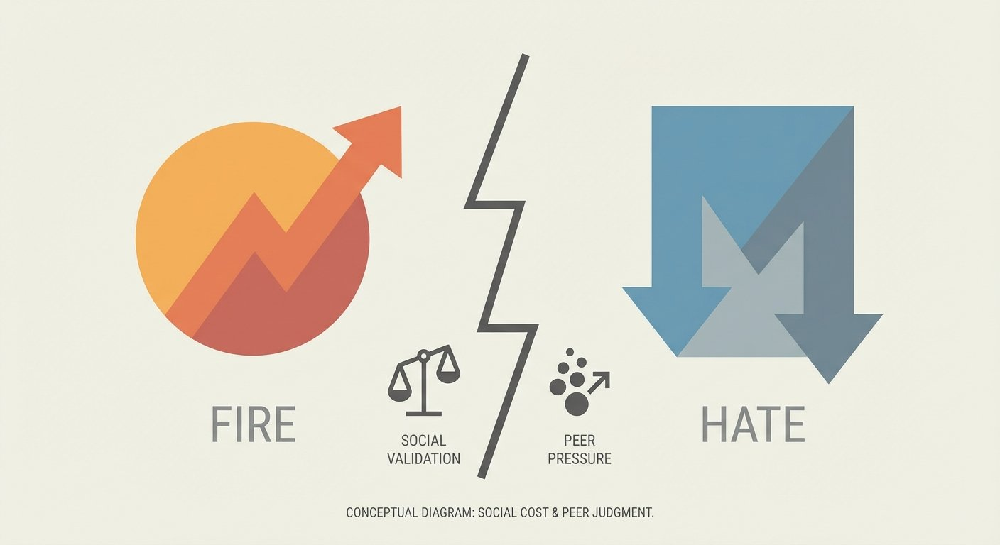

# The Bart Test - Part 7: The Social Cost I Didn't See Coming

*This is Part 7 of the Bart Test series. Read [Part 6](/blog/bart-test-part-6-the-american-ninja-warrior-problem) for Experiment 04 validation results and the American Ninja Warrior analogy.*

## The Hook

After analyzing Experiment 04's results in [Part 6](/blog/bart-test-part-6-the-american-ninja-warrior-problem), I designed Experiment 05 to test a hypothesis: Would tighter constraints improve differentiation, or make the test too easy?

I ran [Experiment 05](https://github.com/bart-mosaicmeshai/bart-test/tree/main/results/05_final_outputs). Printed the [evaluation sheets](https://github.com/bart-mosaicmeshai/bart-test/tree/main/evaluation_sheets/20251230). And prepared to find out.

Then I hit a wall I hadn't anticipated.

One judge was going to fill it out the next day and ask her friend to help. Then this judge told me: "[Friend] hates AI, so I reconsidered asking them."

The second judge was very clear: "Don't ask my friends to help with this!"

## The Story

This wasn't about the sheets being too hard or taking too long. Experiment 04 showed that those improvements worked.

This was about something I hadn't anticipated: **social cost.**

For judges, participating in this experiment carries social implications:
- What will their friends think?
- Is this the "fire kid who knows about AI" or "weird kid doing adult research stuff"?
- Does their friend hate AI? (Apparently in some cases, yes.)

Asking teenagers of any generation to risk or spend social capital for an experiment is a cost I hadn't properly accounted for.

For some judges, it might be fire or novel. For others, it's a different calculation. Their peers know them. Their friends have opinions. The social dynamics are more complex.

## The Reflection

**The social cost discovery reframed the entire problem.**

Before this moment, I thought the challenge was methodological: make the evaluation sheets easier, the scenarios more relatable, the process more sustainable. The paper sheets were working. The process was improving.

But now I was facing a different kind of complexity:
- Supporting judges who face social backlash
- Sustaining judge motivation
- Navigating teenage social dynamics I don't fully understand
- Building relationships with parents and teens I don't know

I could probably solve the logistics:
- Pay judges ($5-10 per session is reasonable)
- Recruit teens who think AI is fire (they exist but they might bias the results)
- Run quarterly sessions with rotating panels

But sitting on the edge of that investment—time, money, relationships—I found myself asking a different question than I'd asked before.

Not "Can I make this work?" but **"Should I?"**

The methodology was working. The hypothesis from Part 6 was ready to test. But was testing it worth navigating all this complexity?

I needed to ask a harder question: **What value does this actually create?**

If Model A is more "culturally fluent" than Model B according to teen judges... so what?

Would anyone make different decisions based on these results?

Is this revealing something about how LLMs work, or just entertaining?

I don't have a clear answer yet. And that uncertainty led me to a harder question: when does an interesting experiment become a useful tool? I'll explore that in depth in part 8.

---

**Part 7 of 9** in the Bart Test series.

---

## Project
**bart-test** - [View on GitHub](https://github.com/bart-mosaicmeshai/bart-test)

## Code References
- [Experiment 05 - Frontier](https://github.com/bart-mosaicmeshai/bart-test/blob/main/experiments/05_new_prompts_test_frontier.py) - Refined prompts for GPT, Claude
- [Experiment 05 - Llama](https://github.com/bart-mosaicmeshai/bart-test/blob/main/experiments/05_new_prompts_test_llama.py) - Local model
- [Experiment 05 - Qwen](https://github.com/bart-mosaicmeshai/bart-test/blob/main/experiments/05_new_prompts_test_qwen.py) - Thinking model
- [Experiment 05 - OLMo](https://github.com/bart-mosaicmeshai/bart-test/blob/main/experiments/05_new_prompts_test_olmo.py) - Reasoning model
- [Experiment 05 Results](https://github.com/bart-mosaicmeshai/bart-test/tree/main/results/05_final_outputs) - All outputs (never validated)
- [HANDOFF.md](https://github.com/bart-mosaicmeshai/bart-test/blob/main/HANDOFF.md) - Full project status

---

*This post is part of my AI journey blog at [Mosaic Mesh AI](https://www.mosaicmeshai.com/blog). Building in public, learning in public, sharing the messy middle of AI development.*
